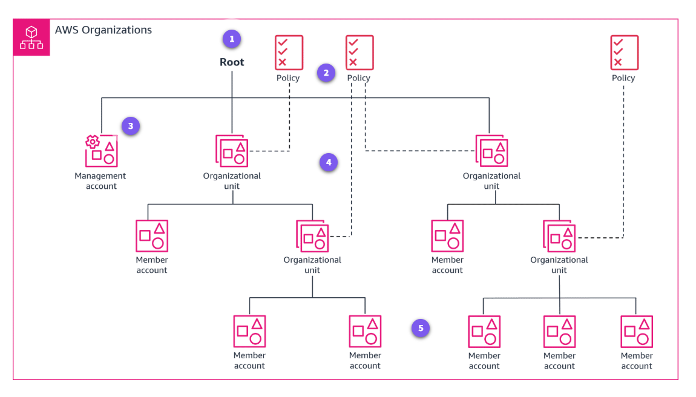
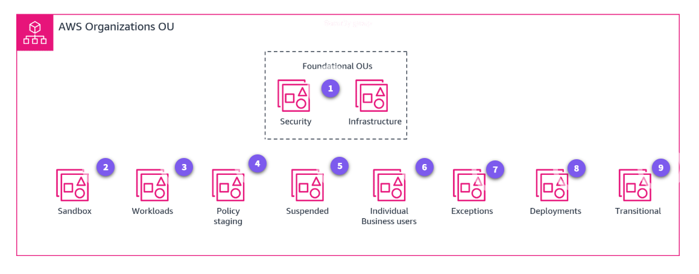

# AWS Organizations Getting Started.

## What problems does Organization solve ?

+ Centralization.
+ Governance.
+ Compliance.
+ Resource sharing.

### Benefits.

+ Provide centralized management across a multi-account environment.
+ Optmize costs and identify cost savings.
+ Customize yout environment by applying policies and controls.
+ Add layers of protection throught IAM integration and support.
+ Operate across Regions with global access.
+ Secure and audit your environment.
+ Share resources across developer teams rapidly and securely.
+ Use at no extra charge.

## You can use Organizations to consolidable bills across multiple accounts.

### How mcuh does Organizations cost ?

### Knowledge check

# Arquitecture and use cases.

## How is organizations used to arquitect a cloud solution ?

+ Organizations helps you to programmatically create new accounts and allocate resources.
+ One single method payments for all yout accounts, and create groups of accounts to organize your workflows.
+ Always apply policies to these groups for governance.

## What are the basic technical concepts of Organizacions ?

### Organization.

+ An organization is an entity for consolidate your AWS accounts as a single unit.
  
### Account.

+ An account is a standard AWS account that contains your AWS resources and the identities that can access those resources.

    + Management account.
    + Member account.
    + Delegated administrator account.
  
### Invitation.

+ Is the process of asking another account to join a you organization.
  
