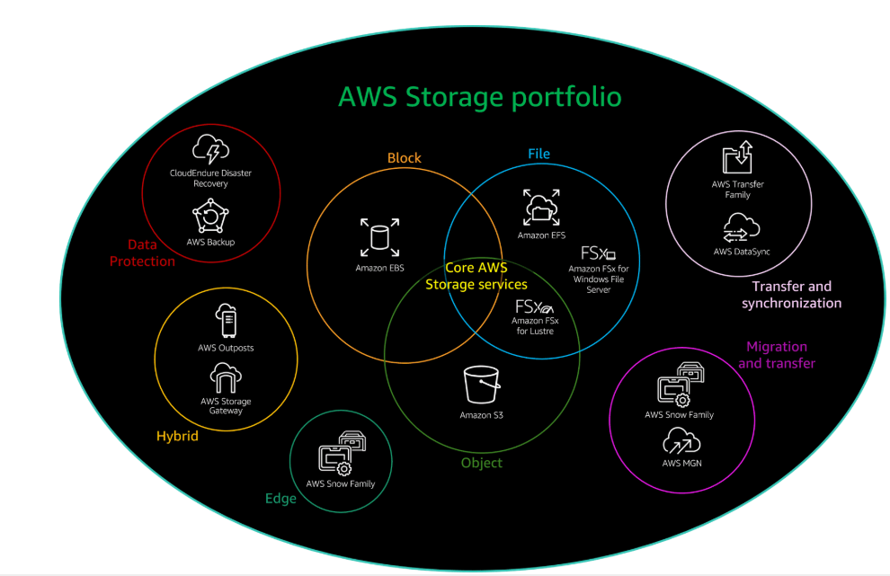
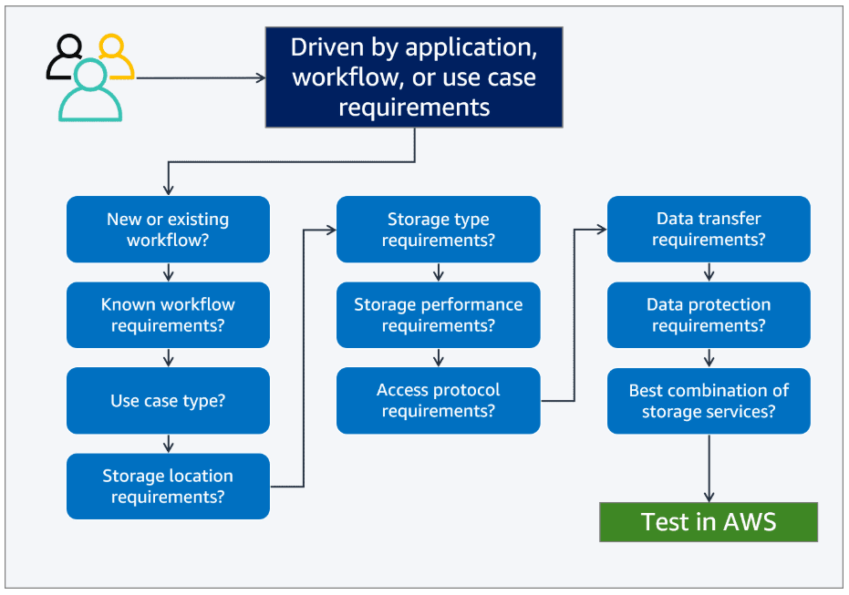

# Bringing AWS Storage Services Together

## Summary of the AWS Storage Portfolio.

## AWS Storage portfolio.

### Data protection.

+ AWS Backup.
+ Cloud Endure disaster recovery.

### hybrid.

+ AWS Outputs.
+ AWS Storage Gateway.

### Edge.

+ Snow Familiy.

### Core AWS Storage Services.

### Block.

+ Amazon EBS.

### File.

+ Amazon EFS.
+ FSx for windows file server.
+ Amazon FSx for lustre.

### Objects.

+ Amazon S3.

## Transfer and syncronization.

+ AWS Transfer family.
+ AWS Datasync.

## Migration and transfer.

+ AWS Snow family.
+ AWs MGN.

## Making your AWS Storage Decision.

