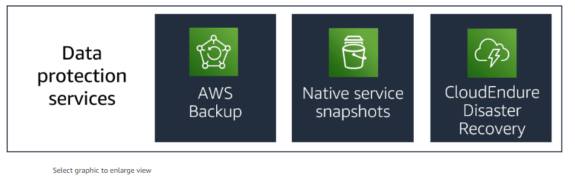
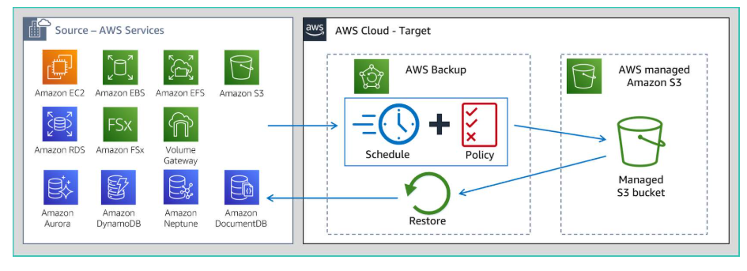

# Protecting Data in the Cloud Introduction

## AWS Backup.

+ AWS Backup for backup in cloud and onpremise.

## Support AWS resources.

+ Included compute, services and databases.

### Compute services 

+ Included Amazon EC2, included amazon EC2 instance stores backup.
+ Windows volumen shadow copy services (VSS) on Amazon EC2.

### Storage Services.

+ Amazon Elastic block store (Amazon EBS)
+ Amazon Elastic File system (Amazon EFS)
+ Amazon Simple Storage Service (Amazon S3)
+ Amazon FSx for Windows File Server.
+ Amazon FSx for Lustre.
+ AWS Storage Gateway Volumes.

### Database services.

+ Amazon Relational database service (Amazon RDS) databases, included all database engine.
+ Amazon Aurora cluster.
+ Amazon DynamoDB Tables.
+ Amazon Neptune databases.
+ Amazon DocumentDB (with MongoDB compatibility) databases.

## AWS Backup features.

+ Centralized backup management.
+ Policy-based backup.
+ Automated backup scheduling.
+ Automated retention management.
+ Lifecycle management policies.
+ Incremental backup.
+ Cross-region backup.
+ Cross-account management and backup.
+ Backup activity monitoring.
+ Secure data.
+ Compliance.

## Uses cases.

+ Data recovery.
+ Data retention.
+ Disaster Recovery.
+ Compliance requerements.

+ There are two cases clearly defined.

+ Cloud native backup.
    + Provide console centralized.
    + Can back up key data stores, such as store volumen, databases and file systems.
        + Amazon EBS
        + Amazon RDS.
        + Amazon DynamoDB.
        + Amazon EFS.
        + Amazon FSx, Amazon EC2.
        + AWS Storage Gateway.

+ Hybryd backup.

AWS Backup integrates with storage gateway, a hybrid storage service to enables your onpremises applications to seamlessy use AWS Cloud Storage.

Pricing.

## Native service snapshots.

+ Snapshots are individial services which provide point-in-time copies the your date.
+ They  

