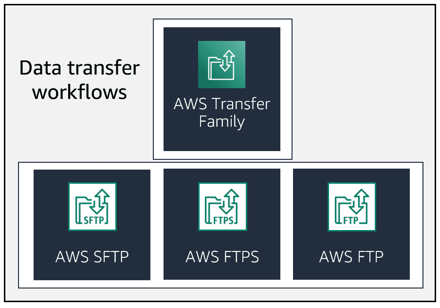
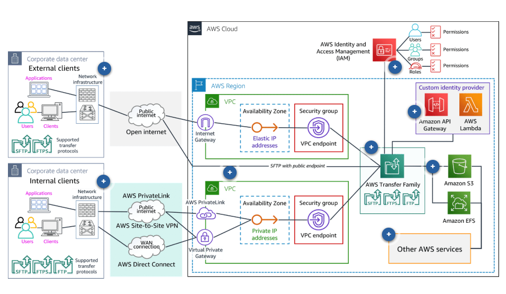
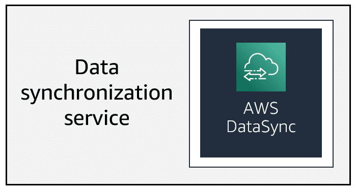
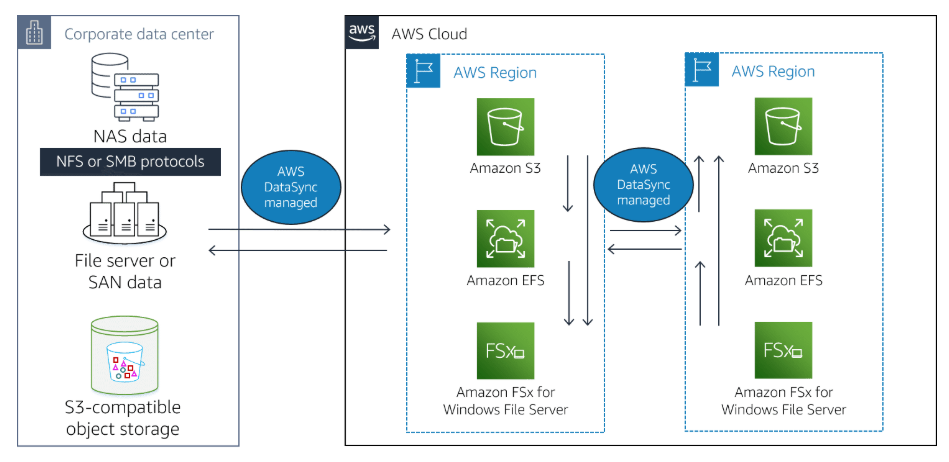
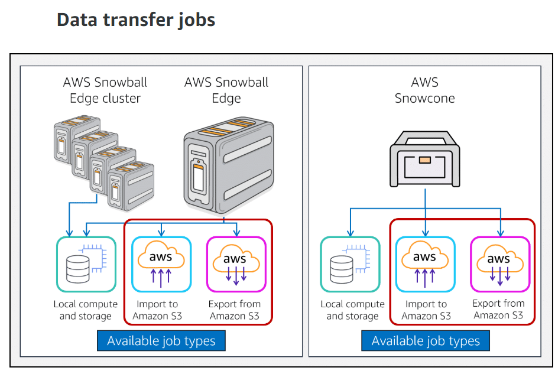

## Transferring Your Data to the AWS Cloud

### Directions:

## Data Transfer and Migration Services 

+ AWS Transfers family. 

    * The AWS Transfer Family is designed to replace on-premises systems for file transfer workflows.

+ AWS DataSync.

    * AWS DataSync synchronizes your data between a source data location or service and a destination location or service.

+ AWS Snow Familiy.

    * The AWS Snow Family provides offline data transfers using physical devices. The AWS Snow Family physical devices are AWS Snowcone, AWS Snowball, and AWS Snowmobile.

+ AWS Application migration service.

    * AWS Application Migration Service (AWS MGN), formerly CloudEndure Migration, provides a migration service between your servers and AWS services.

## AWS Transfers family.

+ AWS SFTP.
+ AWS FTPS.
+ AWS FTP.

 

## AWS Transfer Family features

### Uses cases

+ AWS Transfer Family is used in many different customer use cases to create data transfer environments for access by both internal and external clients.

    * Sharing and receiving files internally and with thirs partys.
      * 
    * Data distribution made secure and easy.
      * AWS transfers family.
    * Shared data lakes.
      * 

## AWS DataSync.

+ AWS DataSync is an online data transfer service that simplifies, automates, and accelerates moving data between on-premises storage systems and AWS Storage services. It can also transfer data between AWS Storage services. 

+ Datasync can copy data beetween the following systems.
    *   NFS shares.
    *   SMB shares.
    *   Self-managed object storage.
    *   AWS Snowcone.
    *   Amazon S3 buckets.
    *   Amazon EFS file systems.
    *   Amazon FSx for windows file server file systems.
  

### AWS Datasync featyres.

+ Automatic infrastructure management.
+ Data encryption and validation.
+ Data transfer scheduling.
+ File system integration and metadata preservation.
+ Integration with AWS infrastructure and management services.
+ Monitoring and auditing with Amazon Cloudwatch and AWS CloudTrail.

### Uses cases

+ AWS DataSync is used in many different customer use cases to create asynchronous data transfer between on-premises data to AWS Storage services and between AWS Storage services.

+ Data migration.

+ Data protection.

+ Archiving cold data.

+ Data processing for edge and hydrid workloads.

## AWS Snow Family.

+ AWS Snowcone.
+ AWS Snowball Edge.
+ AWS Snowmobile.

* help to transport up to exabyte data.
* These devices integrate with AWS security, monitoring, storage management and computing capatibily.

### AWS snowcone.

+ It is the smallest member of the AWS Snow family of edge computing and data transfer devices.
+ Snowcone is a rugered, portable and secure.
+ Can you send offline by shipping or online with a AWS datasync.

### AWS Snowball.

+ AWS snowball storage optimized without compute.
+ AWS snowball storage optimized with compute.
+ AWS snowball Edge compute optimized.

+ AWS snowball edge storage optimized devices provide up to 24 vCPU of compute capacity coupled with 80 terabytes or usable block or Amazon S3-commpatible object storage.

+ AWS Snowball Edge Storage Optimized without compute capabilities is available for import and export only jobs at a lower cost. You still receive 80 TB of S3 compatible storage without available vCPUs or Amazon EBS storage.

### AWS Snowmobile.

+ AWS snowmobile moves up to 100 PB of data in a 45-foot.
+ Is ideal for multi-petabyte or exabyte-scale digital media migrations and data center shutdowns.
+ It is driven back to an AWS Region where the data is loaded into Amazon S3.

### AWS Snow mobile features.

+ Features of the SnowCone and AWS Snowball edge.

+ Fast transfer even at massive scale.
+ Strong encryption.
+ Rugged durable and more secure.
+ Customer for your needs.
+ Massively scalable.
+ Easy data retrieval.

### AWS Snowmobile use case and study.

+ Cloud data migration.

+ DigitalGlobe Case Study: Moving Petabytes of data using snowmobile.

### AWS Application migration services.

(Cloudendure migration)

